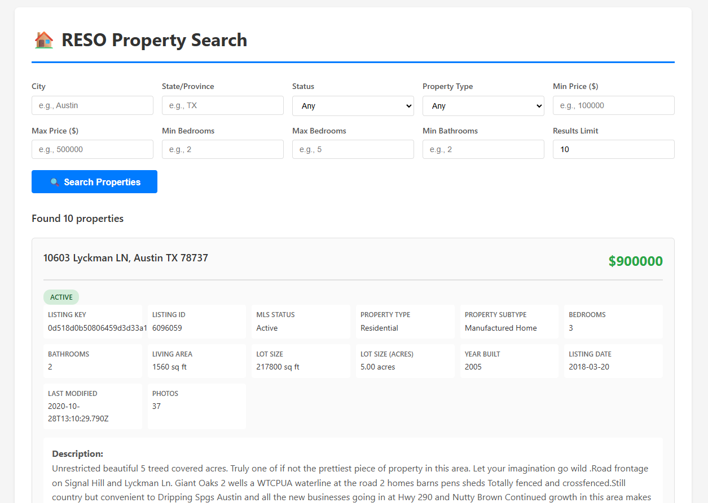
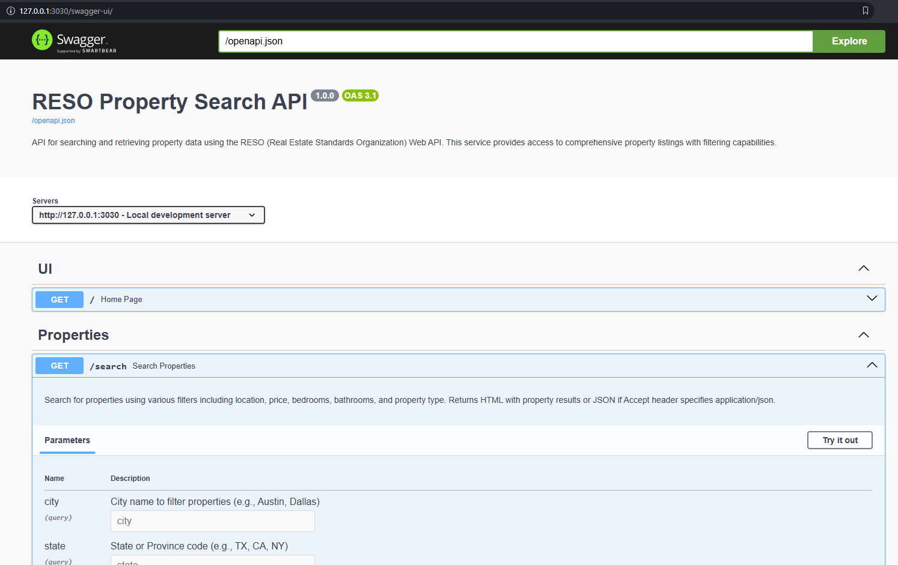

# RESO Examples

A modular Rust application demonstrating how to use the `reso_client` library to interact with RESO Web API servers.



## Project Structure

```
reso_examples_beta/
├── Cargo.toml                  # Project configuration and dependencies
├── .env.example                # Template for environment variables
├── .gitignore                  # Git ignore patterns
├── reso_client-USAGE.md        # Detailed usage guide for reso_client library
├── src/
│   └── lib.rs                  # Core library functions for RESO API interaction
└── examples/
    ├── fetch_metadata.rs       # Example: Fetch and save XML metadata
    ├── query_properties.rs     # Example: Query property data with filters
    ├── advanced_queries.rs     # Example: Advanced features (key lookup, expand)
    ├── replication_sync.rs     # Example: Bulk data replication
    └── axum_property_search.rs # Example: Web service for property search
```

## Features

- **Modular Design**: Core functionality in `src/lib.rs`, runnable examples in `examples/`
- **Environment Configuration**: Credentials loaded from `.env` file
- **Multiple Examples**: Fetch metadata, query properties, advanced queries, replication, web-based search
- **Advanced Query Features**: Key-based lookups, ordering, pagination, entity expansion
- **Bulk Data Replication**: Support for large-scale data synchronization
- **Web Service**: Full-featured Axum web service with search form interface
- **OpenAPI 3.0 Support**: Auto-generated OpenAPI specification for API documentation
- **Swagger UI**: Interactive API documentation and testing interface
- **Error Handling**: Comprehensive error handling with the `ResoError` type
- **Async Support**: Built on tokio for async/await operations

## Setup

### 1. Install Rust

If you don't have Rust installed, get it from [rustup.rs](https://rustup.rs/):

```bash
curl --proto '=https' --tlsv1.2 -sSf https://sh.rustup.rs | sh
```

### 2. Configure Credentials

Copy the example environment file and fill in your RESO API credentials:

```bash
cp .env.example .env
```

Edit `.env` with your credentials:

```env
RESO_BASE_URL=https://api.bridgedataoutput.com/api/v2/OData
RESO_TOKEN=your_bearer_token_here
RESO_DATASET_ID=your_dataset_id_here  # Optional, required by some providers
```

**Where to get credentials:**
- Contact your MLS provider or data vendor
- Common providers: Bridge Interactive, CoreLogic, Rapattoni, FBS (Flexmls)
- You'll need: API base URL, bearer token, and possibly a dataset ID

### 3. Build the Project

```bash
cargo build
```

## Running Examples

### 1. Fetch Metadata

Fetches the XML metadata document from the RESO server and saves it to `metadata.xml`:

```bash
cargo run --example fetch_metadata
```

The metadata describes all available resources (Property, Member, Office, etc.) and their fields.

### 2. Query Properties

Demonstrates various property queries with filters and field selection:

```bash
cargo run --example query_properties
```

This example shows:
- Querying with field selection
- Filtering by city
- Filtering by price range
- Complex multi-condition queries

### 3. Advanced Queries

Demonstrates advanced query features like key-based lookups and expanding related entities:

```bash
cargo run --example advanced_queries
```

This example shows:
- Direct key-based record lookups (more efficient than filtering)
- Expanding related entities (if supported by your server)
- Combining multiple query features (filters, ordering, limits)
- Understanding server capability limitations

### 4. Replication Sync

Demonstrates bulk data synchronization using replication endpoints:

```bash
cargo run --example replication_sync
```

This example shows:
- Building replication queries for bulk data transfer
- Understanding pagination with next_link tokens
- Handling servers that may not support replication
- Best practices for large dataset synchronization

### 5. Axum Property Search (Web Service)

A full-featured web service with a form-based interface for searching properties:

```bash
cargo run --example axum_property_search
```

Then open your browser to one of these endpoints:

- **Web UI**: http://localhost:3030
- **Swagger UI**: http://localhost:3030/swagger-ui
- **OpenAPI Spec**: http://localhost:3030/openapi.json

Features:
- Interactive search form with multiple filter options
- Search by city, state, status, property type
- Filter by price range, bedrooms, and bathrooms
- Beautiful property cards with detailed information
- Real-time search results
- Responsive web interface
- **OpenAPI 3.0 specification** - Auto-generated API documentation
- **Swagger UI** - Interactive API explorer and testing interface

Search filters available:
- Location: City, State/Province
- Status: Active, Pending, Closed, Expired
- Property Type: Residential, Commercial, Land, Multi-Family
- Price Range: Min/Max price
- Bedrooms: Min/Max bedrooms
- Bathrooms: Minimum bathrooms
- Results Limit: Control number of results (max 100)

#### API Documentation

The web service includes comprehensive API documentation accessible through:

1. **Swagger UI** (`/swagger-ui`): An interactive interface where you can:
   - Browse all available endpoints
   - View request/response schemas
   - Test API endpoints directly from your browser
   - See detailed parameter descriptions

2. **OpenAPI Specification** (`/openapi.json`): A complete OpenAPI 3.0 specification that can be:
   - Imported into API tools like Postman or Insomnia
   - Used to generate client SDKs
   - Shared with API consumers for integration



## Using the Library

The `src/lib.rs` module provides reusable functions for common RESO API operations:

```rust
use reso_examples::{
    load_env,
    create_client,
    build_query_with_select,
    execute_query,
    count_records,
};

#[tokio::main]
async fn main() -> Result<(), Box<dyn std::error::Error>> {
    // Load credentials from .env
    load_env()?;

    // Create client
    let client = create_client()?;

    // Count records
    let count = count_records(&client, "Property", Some("City eq 'Austin'")).await?;
    println!("Found {} properties", count);

    // Query with specific fields
    let query = build_query_with_select(
        "Property",
        Some("ListPrice gt 500000"),
        &["ListingKey", "City", "ListPrice"],
        Some(10),
    )?;

    let response = execute_query(&client, &query).await?;

    // Process results
    if let Some(records) = response["value"].as_array() {
        for record in records {
            println!("{}", record);
        }
    }

    Ok(())
}
```

## Core Functions

### Client Management
- `load_env()` - Load environment variables from .env file
- `create_client()` - Create RESO client from environment variables

### Metadata
- `fetch_metadata(&client)` - Fetch XML metadata document

### Query Building
- `build_query(resource, filter, top)` - Build a basic query
- `build_query_with_select(resource, filter, fields, top)` - Build query with field selection
- `build_query_by_key(resource, key, fields)` - Build query for direct key-based lookup
- `build_query_with_order(resource, filter, order_field, direction, top)` - Build query with ordering
- `build_query_with_pagination(resource, filter, fields, skip, top)` - Build query with pagination
- `build_query_with_expand(resource, filter, fields, expand, top)` - Build query with expanded entities
- `build_replication_query(resource, filter)` - Build replication query for bulk data

### Execution
- `execute_query(&client, &query)` - Execute a query and get JSON response
- `execute_replication_query(&client, &query)` - Execute replication query
- `count_records(&client, resource, filter)` - Get count of matching records

### Utilities
- `print_records(&response)` - Pretty-print JSON records from response

## OData Filter Examples

```rust
// Equality
"City eq 'Austin'"

// Comparison
"ListPrice gt 500000"
"BedroomsTotal ge 3"

// Multiple conditions
"City eq 'Austin' and ListPrice gt 500000"

// OR conditions
"City eq 'Austin' or City eq 'Dallas'"

// String functions
"startswith(City, 'San')"
"contains(PostalCode, '78')"

// Date comparison
"ModificationTimestamp gt 2025-01-01T00:00:00Z"

// Complex with parentheses
"(City eq 'Austin' or City eq 'Dallas') and ListPrice gt 500000"
```

## Common Resources

- `Property` - Real estate listings
- `Member` - MLS members/agents
- `Office` - MLS offices
- `Media` - Photos and documents
- `OpenHouse` - Open house events

## Documentation

For comprehensive documentation on the `reso_client` library, see:
- [reso_client-USAGE.md](./reso_client-USAGE.md) - Complete usage guide
- [reso_client repository](https://github.com/jeremeybingham/reso_client) - Source code

## Troubleshooting

### 401 Unauthorized
- Verify your bearer token is correct
- Check that the token hasn't expired
- Ensure `RESO_TOKEN` is set in `.env`

### 404 Not Found
- Verify the resource name is correct (case-sensitive)
- Check if `RESO_DATASET_ID` is required for your provider
- Verify `RESO_BASE_URL` is correct

### Connection Timeout
- Increase timeout: `RESO_TIMEOUT=60` in `.env`
- Check network connectivity
- Verify the server is operational

### Empty Results
- Verify filter syntax (use `eq` not `=`)
- Check string values are quoted: `City eq 'Austin'`
- Test with a simpler filter

## License

Licensed under the terms of the MIT license.

## Resources

- [RESO Web API Specification](https://www.reso.org/reso-web-api/)
- [OData 4.0 Documentation](https://www.odata.org/documentation/)
- [reso_client GitHub](https://github.com/jeremeybingham/reso_client)
